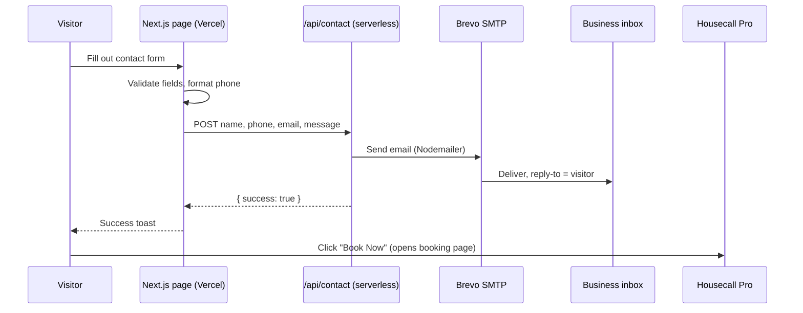

# Portfolio write-up: ATX Reliable Wrenching (Mobile Mechanic Site)

Source material for updating this project's entry in `src/data/projects.ts` (slug for the "Mobile Mechanic Site" entry). Written from the project's actual codebase (`~/Dev/atx-reliable-wrenching`) on 2026-09-27. Everything below is accurate to the code; items marked **[confirm]** need the owner's input before publishing.

## Corrections to the current entry

The existing entry is out of date:

- `stack` says `['HTML', 'CSS', 'JavaScript']`. It's actually Next.js 16 / React 19 / TypeScript / Tailwind CSS v4 (see Stack below).
- `description` calls it "a static site". It's a single page, but not fully static: the contact form posts to a serverless API route that sends email.
- Keep: no `codeUrl` (client repo stays private), `demoUrl` = https://www.atxreliablewrenching.com/, status "Live", button reads "View Live Site".

## Suggested fields

**title:** Mobile Mechanic Site (or "ATX Reliable Wrenching")

**status:** Live

**summary** (one line):
Client marketing site for an Austin mobile mechanic: booking, contact form, and Google reviews, built with Next.js and Tailwind.

**description** (paragraph):
A production marketing site for ATX Reliable Wrenching, a mobile mechanic serving the Greater Austin area. The single responsive page presents their services, experience and Google reviews, sends visitors to online booking through Housecall Pro, and includes a contact form that emails the business through a serverless API route (Nodemailer over Brevo SMTP). The design is built around a signature diagonal motif, with every angled edge sharing one 25° angle, and subtle motion (scroll reveals, a continuously scrolling reviews marquee, hero zoom) implemented without any animation library and disabled for users who prefer reduced motion. Content like services, reviews and business hours lives in plain data files so it's easy to update.

**stack:**
- Next.js 16 (App Router)
- React 19
- TypeScript
- Tailwind CSS v4
- Embla Carousel
- Nodemailer + Brevo SMTP
- Vercel

**metrics** (all verifiable in the code):
- `1` · Page (single responsive page)
- `9` · Services showcased
- `8` · Google reviews featured
- `25°` · Shared angle on every diagonal edge
- `0` · Animation libraries (CSS + one IntersectionObserver)

## Feature list

- **Responsive single page:** hero, services carousel, about, reviews, contact; separate desktop and mobile navigation (switches at 900px).
- **Sticky desktop nav:** the info bar scrolls away while the logo and links stay pinned; the mobile nav is fixed with a dropdown menu.
- **Online booking:** "Book Now" buttons open the business's Housecall Pro booking page.
- **Contact form:** client-side validation (required fields, auto-formatted US phone number, email format), POST to `/api/contact`, email delivered via Nodemailer over Brevo SMTP with the visitor as reply-to, and toast feedback.
- **Services carousel:** Embla-powered, with arrow and dot navigation, cards with hover lift and image zoom.
- **Google reviews marquee:** seamless infinite scroll (list rendered twice, track slides by half its width), pauses on hover, edges fade out.
- **Auto-updating "years of experience"** badge (computed from 2016).
- **SEO metadata** targeting "mobile mechanic in Austin".

## Design and engineering highlights

These are the points that make it more than a template site:

1. **One angle, everywhere, at any size.** The brand look relies on slanted black panels (info bar, logo panel, hero overlay). A diagonal's angle depends on both its horizontal offset and the element's height, so fixed offsets gave every panel a different angle, and the hero's angle drifted whenever the window height changed. The fix is a shared `slant-right` utility: each element passes its own height, and the offset is `height × tan(25°)`. One CSS variable controls the angle site-wide. The hero overlay also widens as it grows taller so the diagonal stays centered, and the mobile logo panel is sized so its diagonal's midpoint sits exactly at screen center.
2. **Robust to browser font size.** Tailwind spacing is rem-based, so the nav bars grow when a visitor has a larger default font size (the owner's browser uses 18px). Pixel-based slant heights stopped matching, which showed up as a thin sliver under the logo. All size-dependent values were moved to spacing units (`calc(var(--spacing) * 27)`), so they line up at any font size.
3. **Motion without a motion library.** Scroll reveals, the reviews marquee, the hero zoom and slide-in, and the Book Now glow pulse are all CSS keyframes plus one small `IntersectionObserver` component. Entrance animations share a single distance/duration token so everything moves consistently. All motion is disabled under `prefers-reduced-motion`; the marquee turns into a swipeable row and hides its duplicate copy.
4. **Accessible marquee.** The duplicated review cards are `aria-hidden`, so screen readers hear each review once.
5. **Designed to be maintained.** Business details (`siteInfo.ts`), services and reviews are plain data files; brand colors and animation timing are design tokens in one stylesheet.
6. **Client-safe iteration.** Every design change is logged in a changelog with its commit, previous values, and revert command, so any change can be rolled back individually if the client prefers the old version.

## Architecture diagram (Mermaid)

**architectureNote** (suggested):
A single Next.js App Router page statically prerendered and served from Vercel, with one serverless route for the contact form. Booking is delegated to Housecall Pro so the business manages appointments in the tool they already use. Content is data-driven (services, reviews, business info in TypeScript files), and all styling and motion come from Tailwind CSS v4 design tokens.

## Lessons learned (suggested)

- A consistent diagonal isn't a fixed offset: the angle depends on height, so it has to be computed per element.
- Don't mix px and rem when values must line up. A user's browser font size silently broke pixel-perfect alignment until everything used the same units.
- Restraint matters for a trade business. An animated "moving border" on the booking button was tried and dropped in favor of a soft glow; subtle motion reads as more professional.
- Keeping a revert-ready changelog made it easy to experiment with a client's live site.

## Usage rights

The client owns the site (code, design and content). The project's `LICENSE` grants the developer portfolio use: screenshots, recordings, descriptions, linking to the live site, naming the client, describing the role and technical decisions, and showing **limited** code excerpts. It does **not** allow publishing the full source code, so keep the entry without a `codeUrl`, and keep any code snippets short.

## Owner input needed [confirm]

- **Your role:** solo design + development + deployment? (The codebase references a Figma design for the backgrounds; confirm whether you designed it.)
- **Timeline:** development started January 2026 (first commit 2026-01-04); redesign/motion pass September 2026.
- **Client details:** OK to name the business (it's already public on the live site)? Any results to share (e.g. bookings, client feedback)?
- **Screenshots:** the entry currently has one image (`/img/mobile-mechanic/mobile-mechanic-1.jpg`), which predates the redesign. New desktop and mobile screenshots of the hero, services and reviews would show the current design and motion work.
