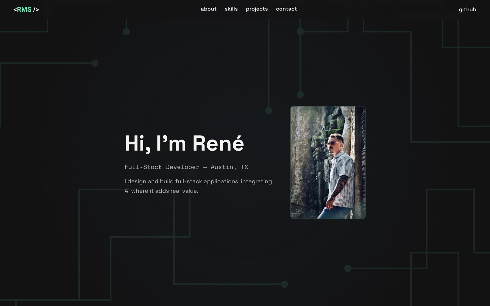

# renemsdev.com

My personal portfolio site, live at **[renemsdev.com](https://renemsdev.com)**.



It's a single scrollable page with Hero, About, Skills, Projects and Contact sections.
Each project card opens a case-study modal with screenshots, architecture diagrams
and lessons learned. Modals are deep-linkable, so `/?project=linkleaf` opens that
project directly.

## What's in it

- **Generative circuit-line background.** The lines behind the page are generated
  in code (`src/components/generative-lines/`) instead of drawn by hand.
- **Project modals.** 3D-tilt cards open a modal with an image carousel and
  architecture diagrams that expand into a lightbox. The diagrams are written in
  Mermaid and pre-rendered to SVG, so Mermaid itself never ships to the browser. Below the `md`
  breakpoint the modal goes full screen.
- **Motion.** Animations use `motion` (the Hero entrance is plain CSS) and respect the
  reduced-motion setting.
- **Content in one file.** All project copy, metrics, diagrams and links live in
  `src/data/projects.ts`.

## Stack

Next.js 16 (App Router), React 19, TypeScript, Tailwind CSS v4, Motion, Mermaid (rendered to SVG ahead of time with `npm run diagrams`),
deployed on Vercel with Vercel Analytics.

## Running it locally

```bash
npm install
npm run dev        # http://localhost:3000
```

| Purpose | Command |
|---|---|
| Lint | `npm run lint` |
| Type-check | `npx tsc --noEmit` |
| Production build | `npm run build` |
| Re-render diagrams | `npm run diagrams` (with `npm run dev` running) |

There's no test suite; lint, type-check and build are the checks. After editing a
diagram's `chart` in `src/data/projects.ts`, run `npm run diagrams`; the build fails
if any diagram SVG is out of date. Rendering drives your installed Google Chrome.

## Project layout

```
src/
  app/                  layout, page, global styles and theme tokens
  components/
    sections/           Hero, About, Skills, Projects, Contact
    generative-lines/   background circuit-line generator
    ui/                 carousel, diagram, lightbox, 3D card
    ProjectModal.tsx    project case-study modal
  data/projects.ts      project content
public/img/             project screenshots and profile photo
public/diagrams/        pre-rendered diagram SVGs (generated, don't edit)
scripts/                diagram render script
docs/                   status, backlog and decision notes
```

## License

[MIT](LICENSE)
